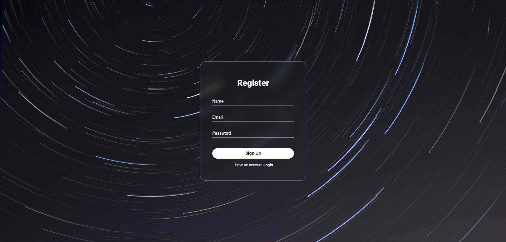
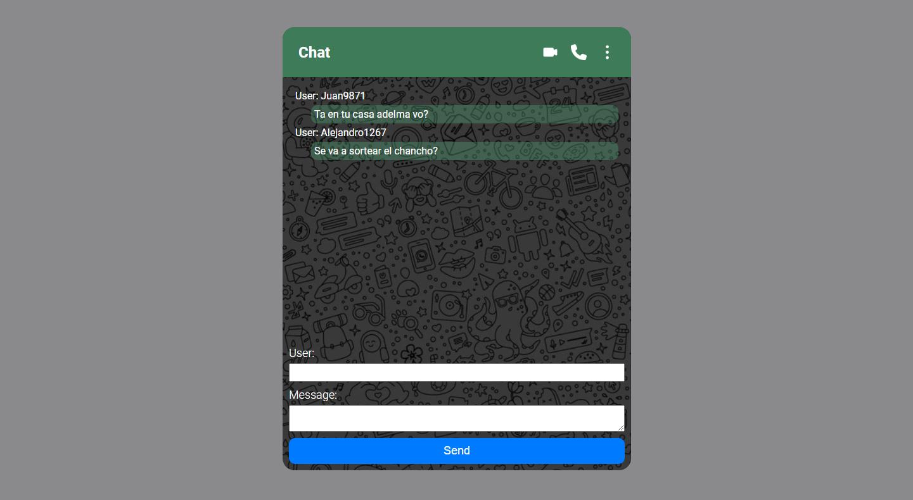
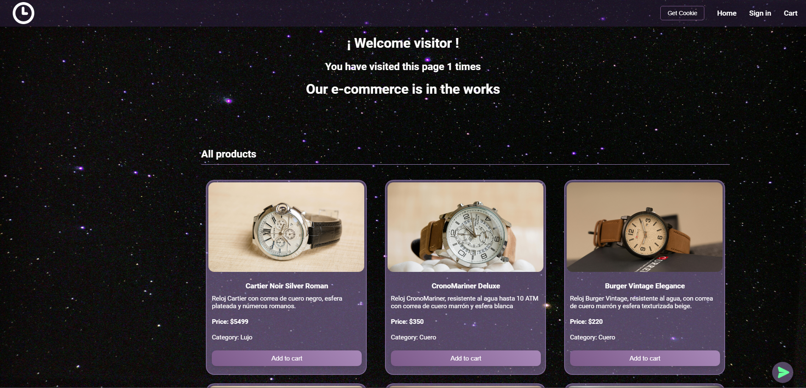
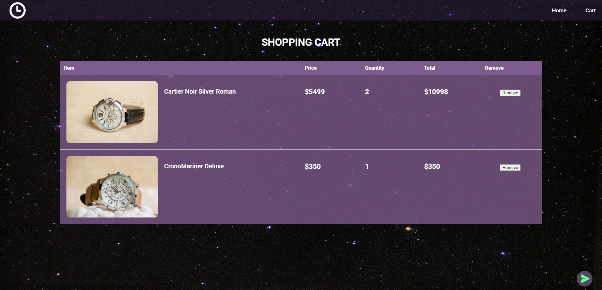
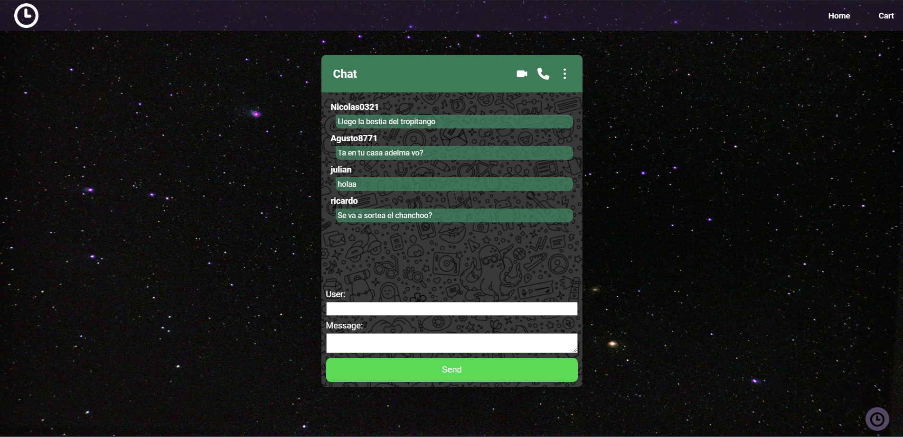

# Proyecto E-commerce

Este es un proyecto e-commerce desarrollado por **Ricardo Piñero**. El proyecto está construido utilizando tecnologías como Mongoose, MongoDB Atlas y Express.

## Descripción

El proyecto permite cargar, agregar, eliminar y editar productos, los cuales pueden ser agregados a carritos de compra. Además, cuenta con un sistema de chat donde los usuarios pueden enviar mensajes y verlos en la página.

## Vista Previa
### Login y Registro



### Home


### Carrito


### Chat


## Dependencias

El proyecto utiliza las siguientes dependencias:

- Express: (^4.18.3)
- Express-handlebars: (^7.1.2)
- Express-session: (^1.18.0)
- Mongoose: (^8.1.3)
- Multer: (^1.4.5-lts.1)
- Connect-mongo: (^5.1.0)
- Cookie-parser: (^1.4.6)

## Uso

Para ejecutar el proyecto, sigue estos pasos:

1. Clona el repositorio:
```bash
git clone https://github.com/rikiippp/Pre-entregas.git
```
2. Instala las dependencias:
```bash
cd Pre-entregas
npm install
```
3. Inicia el servidor:
```bash
node app.js
```

4. Utiliza Postman y tu Navegador Web para interactuar con la API utilizando los siguientes endpoints:

### Endpoints

### Registro de usuario (Vista disponible):
- URL: `http://localhost:8080/`
- Descripción: Esta ruta carga la página de registro cuando se accede directamente a la aplicación.

### Inicio de sesión (Vista disponible):
- URL: ``http://localhost:8080/login``
- Descripción: Página de inicio de sesión.

#### Obtener todos los productos (Vista disponible):
- Método: GET
- URL: `http://localhost:8080/products/`
- Descripción: Obtiene todos los productos disponibles.

#### Obtener un producto por ID (Necesitas Postman):
- Método: GET
- URL: `http://localhost:8080/products/:pid`
- Descripción: Obtiene un producto específico por su ID.
- Donde :pid es el ID del producto.

#### Obtener todos los productos con query (Vista disponible):
- Método: GET
- URL: `http://localhost:8080/products?query=`
- Descripción: Filtra y obtiene productos por categoría (lujo, acero, cuero y digital).

#### Crear un nuevo producto (Necesitas Postman):
- Método: POST
- URL: `http://localhost:8080/products/`
- Descripción: Crea un nuevo producto.
- Cuerpo de la solicitud (en formato JSON):
```json
{
   "title": "Nombre del producto",
   "description": "Description etc,etc",
   "price": 78,
   "stock": 1,
   "category": "Categoria"
}
```

#### Actualizar un producto (Necesitas Postman):
- Método: PUT
- URL: `http://localhost:8080/products/:pid`
- Descripción: Actualiza un producto existente.
- Donde :pid es el ID del producto.
- Cuerpo de la solicitud (en formato JSON):
```json
{
    "title": "Nuevo título",
    "description": "Nueva descripción",
    "price": 50,
    "stock": 1,
    "category": "Nueva categoría"
}
```

#### Actualizar carrito con un nuevo conjunto de productos (Necesitas Postman):
- Método: PUT
- URL: `http://localhost:8080/carts/:cid`
- Descripción: Actualiza los productos en un carrito.
- Uso: Envía una solicitud PUT con una lista de productos y cantidades deseadas en formato JSON y el ID del carrito en la URL.
```json
{
    "products": [
        {
            "productId": "",
            "quantity": 1
        },
        {
            "productId": "",
            "quantity": 1
        }
    ]
}
```

### Actualizar la cantidad de un producto en un carrito (Necesitas Postman):
- Método: PUT
- URL: `http://localhost:8080/carts/:cid/products/:pid`
- Descripción: Actualiza la cantidad de un producto en un carrito.
- Uso: Envía una solicitud PUT con la nueva cantidad en formato JSON y los IDs del carrito y del producto en la URL.
```json
{
    "quantity": 1
}
```

#### Eliminar un producto (Necesitas Postman):
- Método: DELETE
- URL: `http://localhost:8080/products/:pid`
- Descripción: Elimina un producto existente.
- Donde :pid es el ID del producto a eliminar.

### Crear un carrito de compra por ID (Necesitas Postman):
- Método: POST
- URL: `http://localhost:8080/carts`
- Descripción: Crea un nuevo carrito de compra.

#### Borrar producto del carrito (Necesitas Postman):
- Método: DELETE
- URL: `http://localhost:8080/carts/:cid/products/:pid`
- Descripción: Elimina un producto del carrito.

### Borrar todos los productos del carrito (Necesitas Postman):
- Método: DELETE
- URL: `http://localhost:8080/carts/:cid`
- Descripción: Elimina todos los productos del carrito.

#### Buscar un carrito por ID (Vista disponible):
- Método: GET
- URL: `http://localhost:8080/carts/:cid`
- Descripción: Obtiene un carrito de compra por su ID.
- Donde :cid es el ID del carrito.

#### Agregar un producto a un carrito (Necesitas Postman):
- Método: POST
- URL: `http://localhost:8080/carts/:cid/product/:pid`
- Descripción: Agrega un producto al carrito.
- Donde :cid es el ID del carrito y :pid es el ID del producto.

#### Chat (Vista disponible):
- Método: GET
- URL: `http://localhost:8080/chat`
- Descripción: Obtiene y envía mensajes en el chat.

#### Subir archivos (Necesitas Postman):
- Método: POST
- URL: `http://localhost:8080/upload`
- Descripción: Sube archivos a la aplicación.
- En el cuerpo de la solicitud, selecciona un archivo para cargar.
