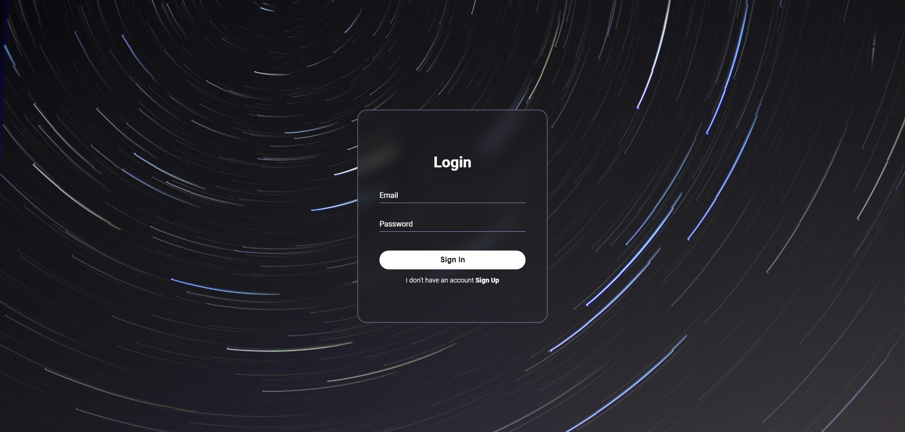

# Proyecto E-commerce

Este es un proyecto ecommerce desarrollado mi **Ricardo Piñero**. El proyecto está construido utilizando tecnologías como Mongoose, MongoDB Atlas y Express.

## Descripción

El proyecto permite cargar, agregar, eliminar y editar productos, los cuales pueden ser agregados a carritos de compra. Además, cuenta con un sistema de chat donde los usuarios pueden enviar mensajes y verlos en la pagina.

## Vista del chat



## Dependencias

El proyecto utiliza las siguientes dependencias:

- Express (^4.18.2)
- Express-handlebars (^7.1.2)
- Mongoose (^8.1.3)
- Multer (^1.4.5-lts.1)

## Uso

Para ejecutar el proyecto, sigue estos pasos:

1. Clona el repositorio:
```bash
git clone https://github.com/rikiippp/1-Practica-integradora.git
```
2. Instala las dependencias:
```bash
cd 1-Practica-integradora
npm install
```
3. Inicia el servidor:
```bash
node app.js
```

4. Utiliza Postman para interactuar con la API utilizando los siguientes endpoints:

### Endpoints

#### Obtener todos los productos:
- Método: GET
- URL: http://localhost:8080/api/products/

#### Obtener un producto por ID:
- Método: GET
- URL: http://localhost:8080/api/products/:pid
- Donde :pid es el ID del producto.

#### Crear un nuevo producto:
- Método: POST
- URL: http://localhost:8080/api/products/
- Cuerpo de la solicitud (en formato JSON):
```json
{
   "title": "Nombre del producto",
   "description": "Description etc,etc",
   "price": 78,
   "stock": 1,
   "category": "Categoria"
}
```

#### Actualizar un producto:
- Método: PUT
- URL: http://localhost:8080/api/products/:pid
- Donde :pid es el ID del producto.
- Cuerpo de la solicitud (en formato JSON):
```json
{
    "title": "Nuevo título",
    "description": "Nueva descripción",
    "price": 50,
    "stock": 1,
    "category": "Nueva categoría"
}
```
#### Eliminar un producto:
- Método: DELETE
- URL: http://localhost:8080/api/products/:pid
- Donde :pid es el ID del producto a eliminar.
- Crear un carrito de compra por ID:
- Método: POST
- URL: http://localhost:8080/api/carts
#### Buscar un carrito por ID:
- Método: GET
- URL: http://localhost:8080/api/carts/:cid
- Donde :cid es el ID del carrito.
#### Agregar un producto a un carrito:
- Método: POST
- URL: http://localhost:8080/api/carts/:cid/product/:pid
- Donde :cid es el ID del carrito y :pid es el ID del producto.
#### Obtener mensajes del chat:
- Método: GET
- URL: http://localhost:8080/api/chat
#### Subir archivos:
- Método: POST
- URL: http://localhost:8080/api/upload
- En el cuerpo de la solicitud, selecciona un archivo para cargar.
